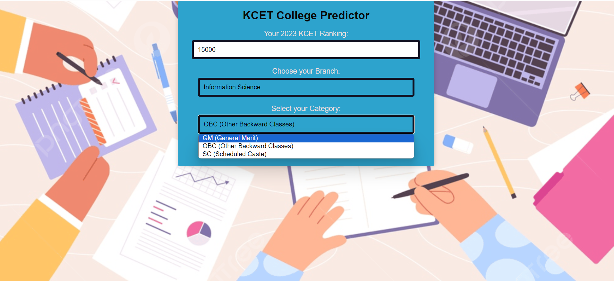
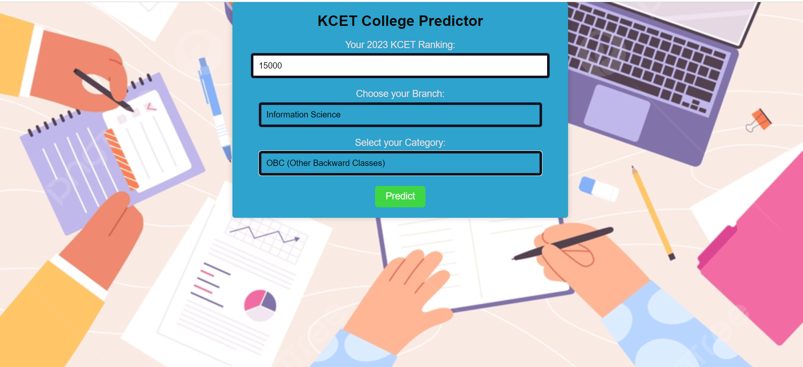
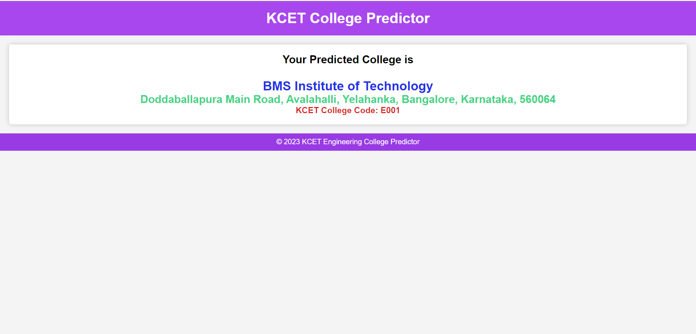

# 2023 KCET Engineering College Prediction Using Machine Learning

# Overview:
This project aims to assist KCET (Karnataka Common Entrance Test) engineering aspirants in predicting the colleges they are likely to get admitted to based on their engineering ranking. The system utilizes a Random Forest Classifier model trained on data from the KCET cut-off ranks for the years 2021 and 2022. The model achieves an accuracy score of 87.9%, providing reliable predictions for students aspiring to pursue Computer Science (CSE) and Information Science (ISE) branches.

## Features

- Flask Web Interface:
The project comes with a user-friendly web interface developed using Flask, allowing students to input their engineering ranking and receive predictions instantly.
- Random Forest Classifier:

The predictive model employs a Random Forest Classifier, a powerful machine learning algorithm known for its accuracy in classification tasks. It leverages the patterns and trends observed in past KCET cut-off data to make predictions.
- Branch Specific Predictions:

Focusing specifically on the Computer Science (CSE) and Information Science (ISE) branches, the model tailors its predictions to the preferences of students in these fields.
- Data Source:

The model is trained on the cut-off data from the KCET examinations held in 2021 and 2022. This ensures that the predictions are based on recent and relevant information.

## Model Performance:

The Random Forest Classifier model used in this project achieves an impressive accuracy score of 87.9%. This high accuracy ensures that the predictions provided to users are reliable and valuable in making informed decisions about their college choices.

Feel free to explore, contribute, and provide feedback to enhance the accuracy and features of the prediction system!

## Screenshots
</img>

</img>

</img>
